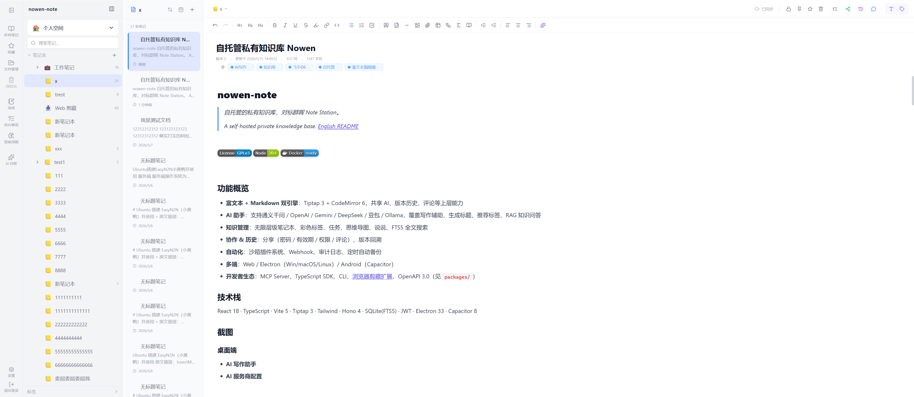
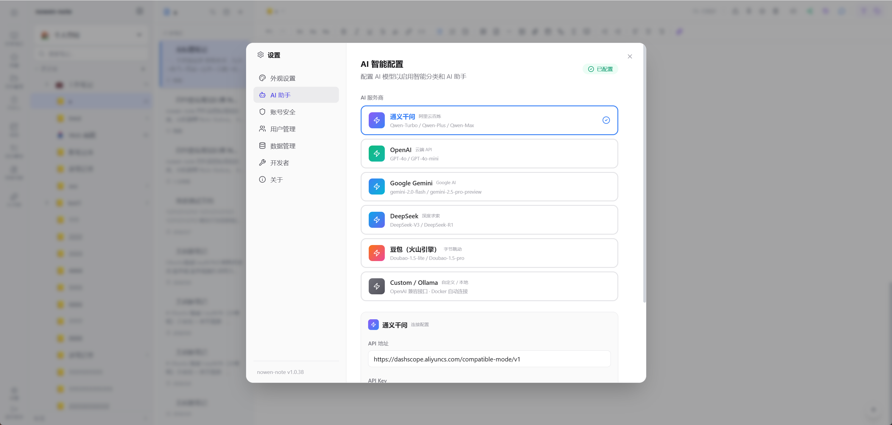
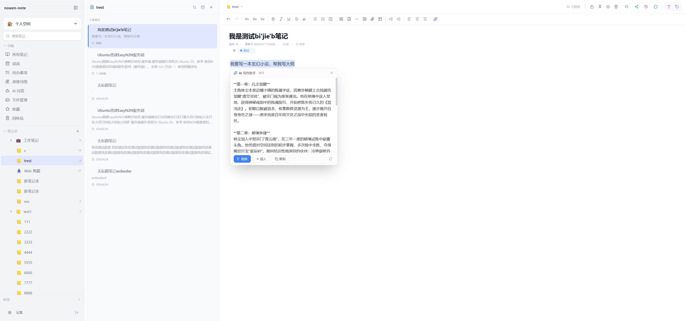
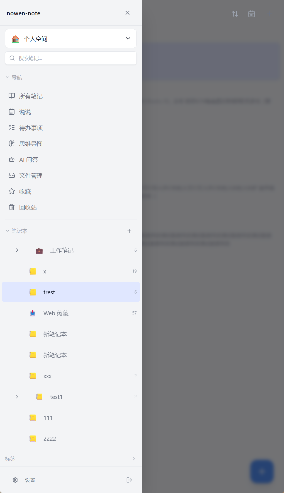
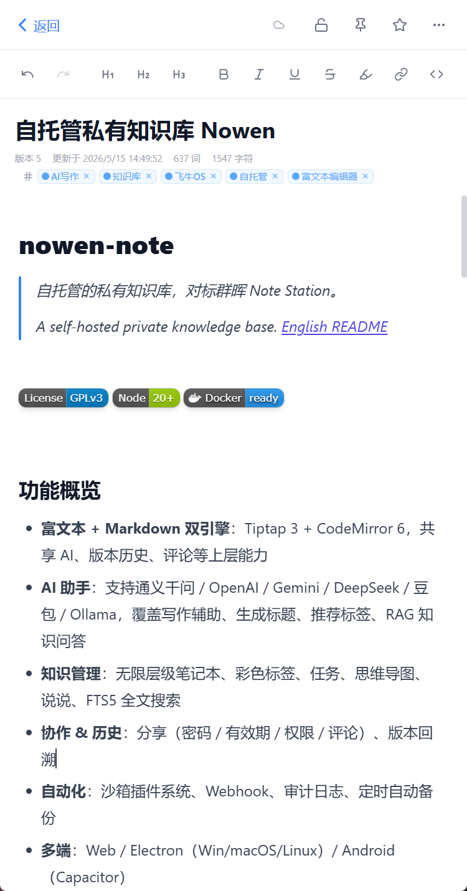

# nowen-note

> A self-hosted private knowledge base, inspired by Synology Note Station.
>
> 自托管的私有知识库。[中文 README](./README.md)

[](./LICENSE)
[](https://nodejs.org/)
[](./Dockerfile)

## Features

- **Dual editor engines**: Tiptap 3 (rich text) + CodeMirror 6 (Markdown), sharing AI, version history, comments and other capabilities
- **AI assistant**: Works with Qwen / OpenAI / Gemini / DeepSeek / Doubao / Ollama — writing assist, title generation, tag suggestion, RAG Q&A
- **Knowledge management**: Unlimited-depth notebooks, color tags, tasks, mind maps, moments, FTS5 full-text search
- **Collaboration & history**: Shared links (password / expiry / permission / comments), version rollback
- **Automation**: Sandboxed plugin system, Webhooks, audit log, scheduled auto-backup
- **Cross-platform**: Web / Electron (Win/macOS/Linux) / Android (Capacitor)
- **Developer ecosystem**: MCP Server, TypeScript SDK, CLI, [browser clipper extension](https://chromewebstore.google.com/detail/nowen-note-web-clipper/nglkodhfdbnfielchjpkjhenfaecafpg), OpenAPI 3.0 — see [`packages/`](./packages)

## Stack

React 18 · TypeScript · Vite 5 · Tiptap 3 · Tailwind · Hono 4 · SQLite(FTS5) · JWT · Electron 33 · Capacitor 8

## Screenshots

### Desktop

| AI writing assistant | AI provider settings |
| :---: | :---: |
|  |  |

### Mobile (Android / Capacitor)

| Sidebar | Note list | Editor |
| :---: | :---: | :---: |
|  |  |  |

## Quick Start

> Default admin: `admin` / `admin123`. Please change the password immediately after first login.

### Docker (recommended)

```bash
git clone https://github.com/cropflre/nowen-note.git
cd nowen-note
docker-compose up -d
```

Open `http://<your-ip>:3001`.

### Local development

Requires Node.js 20+.

```bash
git clone https://github.com/cropflre/nowen-note.git
cd nowen-note
npm run install:all
npm run dev:backend   # backend on :3001
npm run dev:frontend  # frontend on :5173
```

Open `http://localhost:5173`.

### Desktop / Mobile

```bash
npm run electron:dev      # Electron dev
npm run electron:build    # Package for Windows / macOS / Linux
```

For Android, download the APK directly from [Releases](https://github.com/cropflre/nowen-note/releases), or build it yourself with `npx cap sync android && npx cap open android`.

### fnOS (one-click .fpk install)

Grab the latest `nowen-note-x.y.z.fpk` from [Releases](https://github.com/cropflre/nowen-note/releases). On your fnOS NAS, open **App Center → Settings → Install app manually** and pick the file. After installation, click the "Nowen Note" icon on the desktop or open `http://<nas-ip>:3001` in your browser.

> The .fpk currently targets x86_64 fnOS only (`platform=x86`). To build it yourself, see [scripts/fpk/README.md](./scripts/fpk/README.md).

## Configuration

| Env var | Default | Description |
| --- | --- | --- |
| `PORT` | `3001` | Service port |
| `DB_PATH` | `/app/data/nowen-note.db` | Database file path |
| `OLLAMA_URL` | — | Local Ollama endpoint (optional) |

Data persistence: mount **`/app/data`** from the container to the host (not `/data`). The image declares `VOLUME ["/app/data"]`, so mainstream NAS panels will prefill this path.

Backup policy: auto-backups are written to `/app/data/backups` by default, sharing the same volume as the data. Following the 3-2-1 rule, it is strongly recommended to mount `/app/backups` to a separate disk and set `BACKUP_DIR=/app/backups` — see the inline notes in [`docker-compose.yml`](./docker-compose.yml).

## Documentation

- Browser clipper extension (Chrome / Edge): [Chrome Web Store](https://chromewebstore.google.com/detail/nowen-note-web-clipper/nglkodhfdbnfielchjpkjhenfaecafpg)
- Deployment guide (Local / Docker / Desktop / Mobile / Synology / UGREEN / QNAP / fnOS / ZSpace / ARM64): [docs/deployment.md](./docs/deployment.md)
- fnOS .fpk packaging: [scripts/fpk/README.md](./scripts/fpk/README.md)
- ARM64 details: [docs/deploy-arm64.md](./docs/deploy-arm64.md)
- Email backup configuration: [docs/backup-email-smtp.md](./docs/backup-email-smtp.md)
- Editor mode switch: [docs/editor-mode-switch.md](./docs/editor-mode-switch.md)
- Privacy policy: [docs/PRIVACY.md](./docs/PRIVACY.md)
- OpenAPI: once running, visit `/api/openapi.json`

## Support

QQ group: `1093473044`

## Sponsor

If this project helps you, feel free to scan the QR code and buy the author a coffee.

<p align="center">
  
</p>

## License

[GPL-3.0](./LICENSE) — derivative works must also be distributed under GPL-3.0 and preserve the original copyright notice.

<!-- CHANGELOG:BEGIN -->
## 更新日志

> 最近 5 个版本的更新内容，完整历史见 [CHANGELOG.md](./CHANGELOG.md)。

### v1.0.36 - 2026-05-12

### ✨ 新增

- **clipper**: AI optimize clipped content via nowen-note backend (fbc1249)
- **frontend**: wire FileManager/TiptapEditor with new attachment refs + i18n (0376a01)
- **backend**: add AI clip-enhance API and attachment/share infra (bb91576)
- **rag**: support xlsx/xlsm/xltx attachment indexing for AI Q&A (d184942)

### 🐛 修复

- **release**: prevent cross-platform native module mismatch in Win installer (5d73e19)

### 🔧 其他

- **clipper**: support Chrome/Edge/Firefox packaging + release v0.1.1 artifacts (10b36d2)

### v1.0.35 - 2026-05-11

### 🐛 修复

- **db**: 修复老库启动崩溃 SqliteError: no such column: workspaceId (d445c10)
- **release**: .fpk 产物只收集当前版本，避免 dist-fpk 历史堆积误传 (4e3bf3b)

### v1.0.34 - 2026-05-11

### 🐛 修复

- **db**: 修复老库启动崩溃 SqliteError: no such column: conversationId (984b1c4)
- **electron**: 修复 Win 安装包启动报 ERR_DLOPEN_FAILED 的根因 (8d2da99)
- **tasks**: 更新任务后同步刷新左侧分组计数（今天/未来7天/已逾期） (b39a825)
- **tasks**: 修复待办按日期分组/展示的时区错位（今天/本周/逾期） (edcc285)

### v1.0.33 - 2026-05-11

### ✨ 新增

- **ai**: 知识问答支持多会话（多聊天并行保存） (d10764c)
- **ai**: 批量 AI 操作（标签/归类） (a11bdc2)
- **ai**: 笔记归类建议（AI 自动目录归类） (313b200)
- **ai**: 自定义指令模板可保存与复用 (2395a93)
- **ai**: RAG 知识库支持附件内容索引（PDF/文本/docx 等） (afdc482)
- **backup**: 自动备份支持每日定时/保留数量/邮件通知 (eded447)
- **users**: 个人空间导出/导入开关下沉为 per-user 字段 (4769c7f)
- **upload**: 附件上传支持拖拽 (beb74d8)
- **ios**: 接入 Capacitor iOS 工程骨架与 GitHub Actions TestFlight 发版 (0320ba8)

### 🐛 修复

- **build**: unpdf 加入 esbuild external 名单，修复后端 bundle 失败 (bb46727)
- **backend**: 修复 backup.ts 重载签名默认参数导致的 TS2371 编译错误 (b69d66a)
- **security**: RAG 知识库索引按工作区/个人空间隔离 (5e5e899)
- **ui**: 修复笔记列表长标题挤掉预览行 (2b9d4c9)
- **ai**: AI 写作助手 markdown 格式化丢失链接和图片 (91e42e4)
- **electron**: 修复 main.js 第 702 行非法字符串导致主进程启动崩溃 (e851eeb)
- **release**: 仅上传当前版本产物到 GitHub Release，避免历史包混入 (91edab8)

### v1.0.32 - 2026-05-09

### ✨ 新增

- **release**: wire NOWEN_BUILD_TIME/APP_VERSION into Docker, add lite/clipper targets (d3ab15f)
- **update**: tighten cross-platform update flow (8b56551)
- **update**: in-app update notifier & clipper pack tweaks (1ba6730)
- **about**: add sponsor QR card in Settings -> About (9f78cd3)

### 🐛 修复

- bug (de5b1dc)
- **update**: suppress banner when appVersion already matches (127c1ee)
- **notes**: enforce workspace isolation on note move (a783d31)
- **clipper**: derive firefox manifest from chrome manifest (bef9e82)
- **attachments**: inherit workspaceId from note on upload (65a71cd)

### 📝 文档

- document fpk one-click install for fnOS (6d7c588)

<!-- CHANGELOG:END -->
